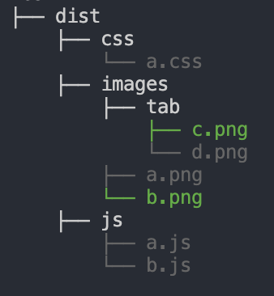

# 阿里云oss工具集

## 功能

首先创建`OSS`对象(配置参考[ali-oss](https://github.com/ali-sdk/ali-oss#ossoptions)):
```javascript
const { OSS } = require('ali-oss-toolkit');

// 创建oss对象
const oss = new OSS(
  {
    accessKeyId: 'test',
    accessKeySecret: 'test',
    bucket: 'xngstatic',
    endpoint: 'oss-cn-shenzhen.aliyuncs.com',
  },
  true, // debug 开启调试模式不会真正和oss交互, 而是mock, 用于调试配置是否正确, 默认开启
);
```

### .upload(patterns, ossBase[, options])

- `patterns` {string | string[]} 必填 [glob](https://github.com/isaacs/node-glob#glob-primer) 匹配模式, 相对于`localBase`
- `ossBase` {string} 必填 oss根目录, !!!注意：必须确认清楚，不要传到其他项目里覆盖了其他项目的内容
- `options`
  - `localBase` {string | undefined} 可选 本地根目录, 最终的匹配结果是`patterns`和`localBase`拼接的结果, 上传后的文件名不包含`localBase`
  - `ignore` {string | undefined} 可选 忽略文件的匹配模式，相对于`localBase`

example:
```javascript
// 上传 dist 目录下除了 index.html 的所有内容到 xngstatic 下 op 目录
// dist/images/a.png -> op/images/a.png
// dist/index.js -> op/index.js
oss.upload('**/*', 'web/xng-op', {
  localBase: 'dist',
  ignore: 'index.html',
});
```
远程已经存在的文件为灰色，上传成功的为绿色

